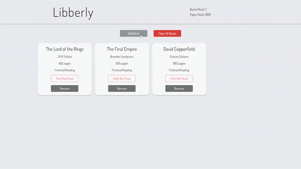

# Libberly
Libberly is a simple-to-use Library application. You can store your finished and/or unfinished books, track your reading stats, and even remove unwanted books. It uses local storage so that all your books will be there even if you leave the browser.

**Link to project:** https://johnsebastian3.github.io/libberly/

## How It's Made:

**Tech used:** HTML, CSS, JavaScript

This app was built with JS and what makes it really powerful is Local Storage. I used local storage to store the books so that it can actually work as a library.

## Optimizations

Optimizations planned are refactoring code and adding ability to edit books already in library.

## Lessons Learned:

During this project, I learned a lot about Local Storage. I learned how to set and get items, and how to store and retrieve objects such as arrays in/from Local Storage using JSON methods.

